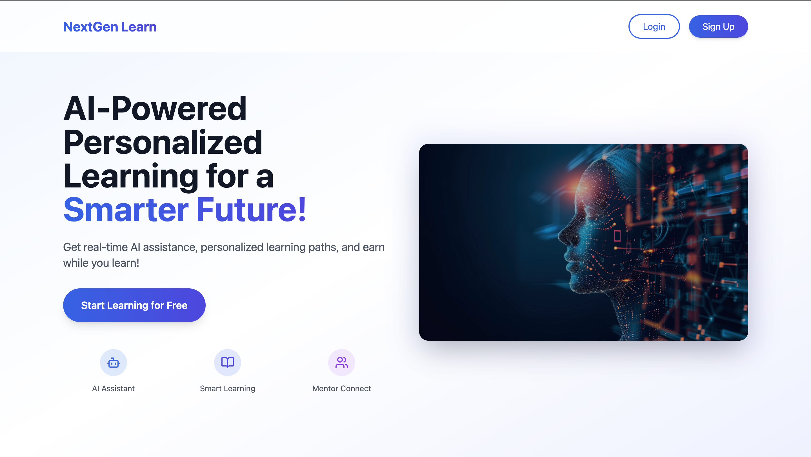
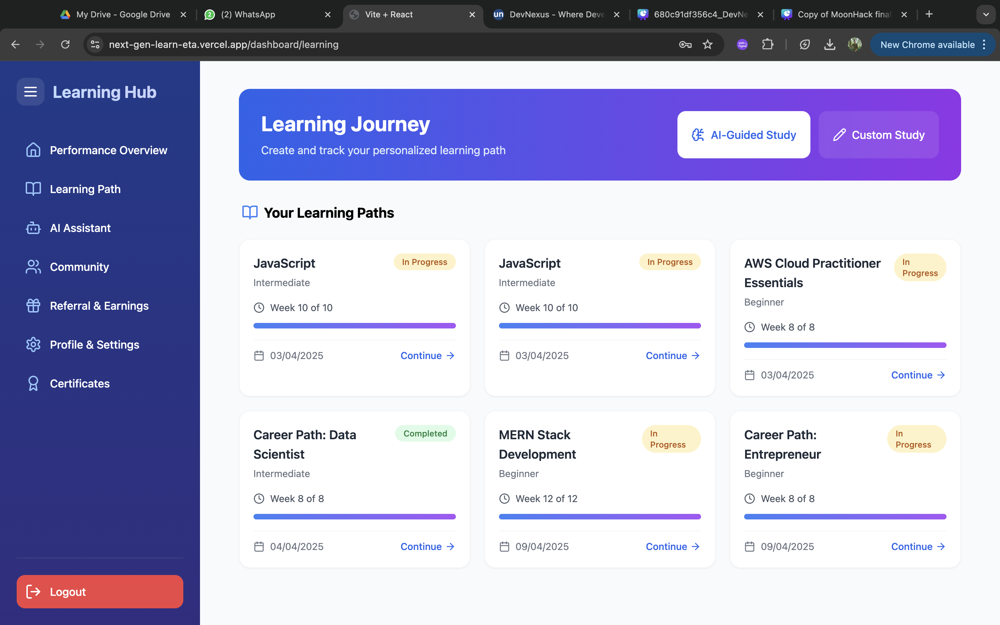
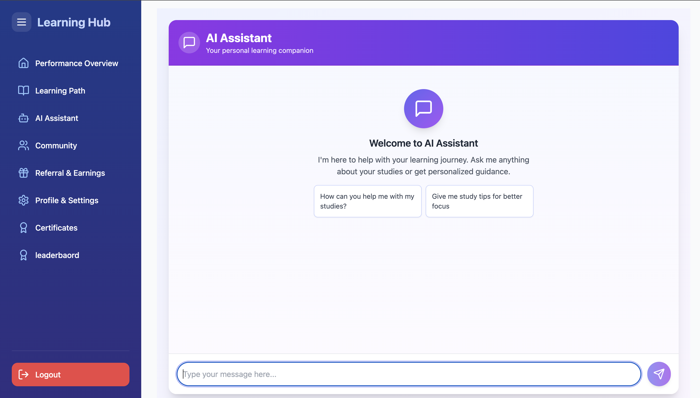
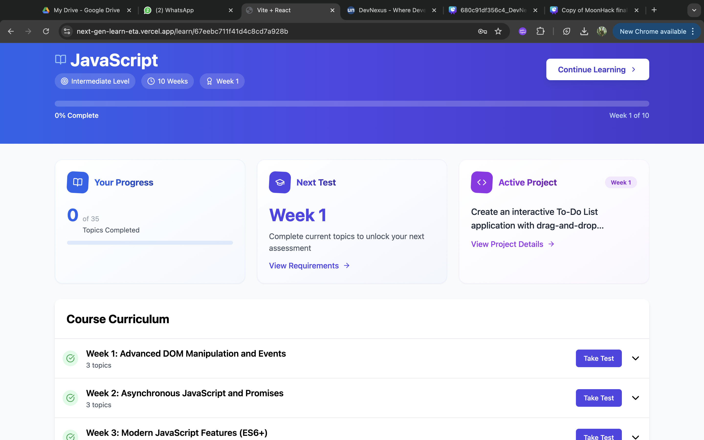
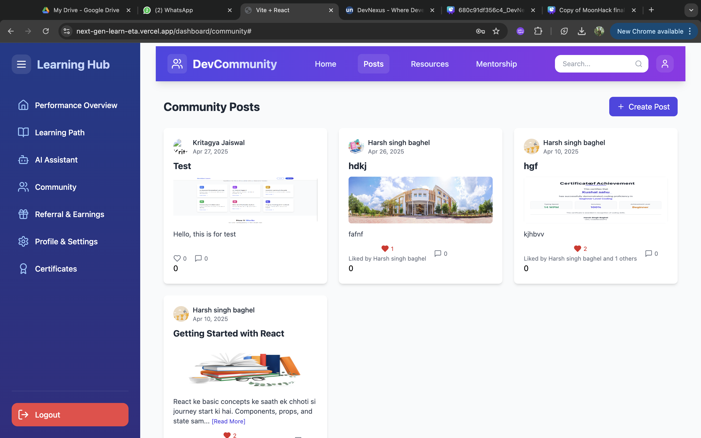
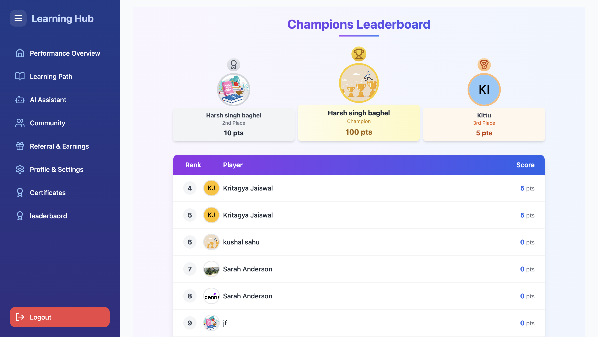

# 🚀 NextGen Learn  
**Unlock Your True Potential with AI-Powered Personalized Learning!**



---

## 🧠 Problem Statement

Traditional e-learning platforms struggle with:
- ❌ Lack of personalized learning
- ❌ Slow or no doubt-solving support
- ❌ Boring, non-engaging systems
- ❌ Limited collaboration opportunities

---

## ✅ Our Solution – NextGen Learn

**NextGen Learn** tackles these challenges through:

- 🎯 AI-powered personalized learning paths  
- 🤖 Real-time doubt-solving with AI chatbot  
- 🕹️ Gamified experience: quizzes, badges, leaderboards  
- 👨‍🏫 Peer and mentor collaboration  
- 💰 Earn-while-you-learn monetization model  

> Making learning smarter, faster, and more rewarding 🚀

---

## 🌟 Core Features

### 📚 Personalized Learning Paths  
Adaptive journeys tailored to each user's performance.  


---

### 🤖 AI Chatbot Assistance  
Real-time help from an AI tutor using Gemini API.  


---

### 🏆 Gamified Learning Experience  
Engaging UI with quizzes, badges, rewards, and leaderboards.  


---

### 👥 Community Learning  
Collaborate, discuss, and learn with mentors and peers.  


---

### 💸 Referral & Monetization  
Users can earn rewards through referrals or as community mentors.  


---

### 📊 Learderboard  
Visualize growth with dashboards and instant feedback.  


---

## 🛠️ Tech Stack

| Layer      | Tools/Frameworks                         |
|------------|------------------------------------------|
| Frontend   | React.js, Redux Toolkit, Tailwind CSS    |
| Backend    | Node.js, Express.js                      |
| Database   | MongoDB                                  |
| Auth       | JWT (JSON Web Token)                     |
| AI/ML      | Gemini API, LangChain                    |
| Realtime   | Socket.IO                                |
| Media/Storage | Cloudinary                            |


---

## 🧩 Architecture / Flow Diagram  
(Show how AI, user progress, and real-time updates flow.)  


---

## 🎥 Demo

📺 Watch the full demo here: [Link to demo video](#)

---

## 📌 Setup Instructions

```bash
# Clone the repo
git clone https://github.com/your-username/nextgen-learn.git

# Navigate to the project
cd nextgen-learn

# Install dependencies for frontend and backend
cd client && npm install
cd ../server && npm install

# Run the app
npm run dev
